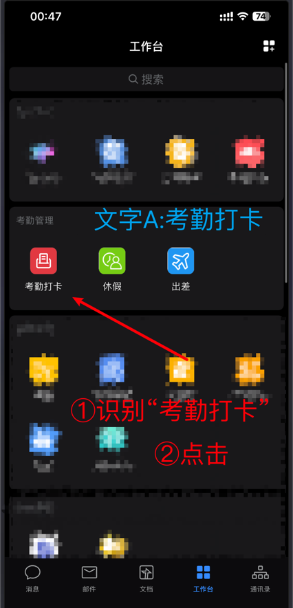
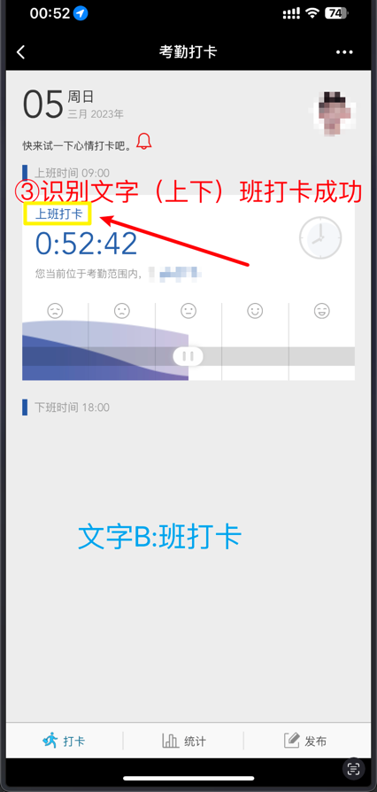
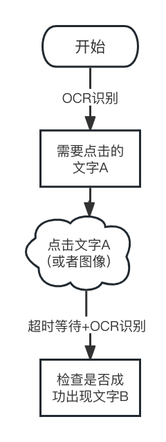

<div align="center">

# AACO_ADB_Auto_Clock_with_OCR
AACO项目开发的原意是使用ADB进行自动打卡，同时加入了OCR识别、超时等待、自动重连和短信通知等特性
<br>自用长期稳定，开源出来贡献给大家，欢迎提交代码！
<br>

<a href="https://twitter.com/Elliot58616851" target="_blank"> </a>

<div>
    
</div>
<div>
    
    
</div>
<br>

[🇨🇳简体中文](./README.md) | [🇺🇸English](./README-en.md) | [🇩🇪Deutsch](./README-de.md)


此项目仅供非营利性学习研究，请勿用作非法用途，如有侵权请及时联系删除

</div>


# 0x00 介绍
上下班打卡是我最讨厌的事情，某天晚上翻来覆去睡不着，想起了[SQLite源码](https://github.com/sqlite/sqlite/blob/master/LICENSE.md)的三句话：
>May you do good and not evil.  
May you find forgiveness for yourself and forgive others.  
May you share freely, never taking more than you give.  

所以我将基于ocr识别的adb打卡程序开源出来，自己用的很稳定，配置简单，兼容性强，适合绝大部分文字识别点击打卡，具有以下特性：
- 中国节假日判断自动打卡
- 基于OCR识别，准确高，反应快
- 加入超时等待（默认4次16+8+4+2秒）
- 加入出错重试（默认3次）
- 出错重试失败后进行短信通知（需要阿里云短信api）
- 加入图像识别范围（纯文字不够用，需要点击图标的情况）
- 配置简单，只有1个配置文件
- 拥有日志、截图辅助判断打卡情况

# 0x01 前期准备
该项目基于安卓的adb打卡，意思就是要有一个手机放公司，或者刷定位模块  
然后开启安卓手机的开发者模式，打开adb，可以用有线连接，也可以无线  
此外该项目还集成了阿里云短信通知，需要可以自行开启  
所需条件：
- 安卓手机（硬件）
- 手机开启adb并正确连接（设置）
- 公司一台开启的电脑（硬件）

前置知识：ADB调试，自行谷歌

# 0x02 打卡原理
我们假设打卡的识别顺序是这样的：
1. 识别文字A(考勤打卡)--确认点击
2. 点击后等待跳转，确认文字B（班打卡）--确认点击成功，流程结束

给个图演示一下  

<div align="left">

</div>

给个流程图演示一下  


就是这么简单。其中涉及到一些出错重试、手机性能羸弱导致超时等待、多处文字干扰等一些功能，详见最后[其他说明]()  
我们就关注于：__找到需要某个点击的文字（图标）__ --> __确认点击成功的结果__  
我们来举个企业微信打卡例子：
1. 打开企业微信 -->  出现<消息>界面 
2. 点击<工作台> -->  出现<考勤打卡>按钮
3. 点击<考勤打卡>   -->  出现上<班打卡>按钮
4. 点击(打卡图片)   -->  是否<确认>打卡？
5. 点击<确认>打卡按钮   -->  打卡成功

这样就是一个整体的打卡流程, 逻辑是不是很简单？  
__顺序就是打开企业微信-->点击工作台-->点击考勤打卡-->点击打卡（图片）-->点击确定-->打卡成功！__

# 0x03 配置说明
基于KISS原则(Keep It Simple, Stupid),只有一个配置文件需要修改  
将`config.ini.template`改为`config.ini`文件,然后修改配置  
配置文件使用模块化，分为3个部分  
[Config] 默认配置，api、通知等  
[Steps] 每一步的步骤  
[Users] 多用户机器配置

只要添加[Steps]里的配置即可
```editorconfig
[Steps]
# 一共需要4步的点击和判断
TotolSteps = 4

[Step1]
# 选择识别的类型（文字/图片/完成）
Step_Type = TEXT
# 需要点击的文字A
Step_Input = 工作台
# 需要确认点击是否成功的文字B（下同）
Step_Output = 考勤打卡

[Step2]
Step_Type = TEXT
Step_Input = 考勤打卡
Step_Output = 班打卡

[Step3]
# 这里就需要点击图片了
Step_Type = IMAGE
# 这里使用图片的相对路径
Step_Input = /src_img/buoy.png
Step_Output = 确定

[Step4]
# 最后一步识别，不做点击成功判断
Step_Type = FINISH
Step_Input = 确定
```

好，步骤配置到这里就完成大头了，剩下的还要配置一下IP地址、端口、打卡设备名称和短信通知API（可选）

```editorconfig
[Users]
User_list = User1,User2

[User1]
Connect_Type = Wifi
IP_Address = 192.168.99.106
Port = 5555
Device_Name = Rami的小米手机9
# 需要进行短信通知的手机号，留空为不通知
SMS_Phone = 130xxxxxxxx

[User2]
Connect_Type = USB
Series_Strings = xxxxx
Device_Name = Rami的小米手机9
# 需要进行短信通知的手机号，留空为不通知
SMS_Phone = 130xxxxxxxx
```
到这里配置文件基本就修改完成了,如果需要阿里云短信通知，自行放入配置文件里即可

# 0x04 其他配置
## 4.1 可信任设备
在ADB首次连接的时候，会出现是否信任该电脑，允许即可  
## 4.2 ADB不可用
有的手机太旧了，adb版本太新不支持，使用旧版本adb即可


# 0x05 运行
假设你已经完成了上面的
1. adb正确链接手机
2. 配置文件编写完成

那恭喜你，可以开始尝试运行脚本了！
```shell
# 以ubuntu为例
apt install android-tools-adb python3-pip build-essential libgl1-mesa-glx

# 克隆仓库
git clone --depth=1 https://github.com/elliot-bia/AACO_ADB_Auto_Clock_with_OCR.git
cd AACO_ADB_Auto_Clock_with_OCR
# 安装pytorch, 可以参考https://pytorch.org/进行更改
pip3 install torch torchvision torchaudio --index-url https://download.pytorch.org/whl/cpu
pip install cnocr -i https://pypi.doubanio.com/simple 
pip install opencv-python pure-python-adb alibabacloud_dysmsapi20170525==2.0.23 chinesecalendar aircv  -i https://pypi.tuna.tsinghua.edu.cn/simple  

# 运行
python ./bin/main.py
```
如果感觉无从下手，可以请我帮你远程指导，只需要打赏¥200即可购买我的一小时的帮助（牛郎在世🤣  
或者参考[Wiki](https://github.com/elliot-bia/AACO_ADB_Auto_Clock_with_OCR/wiki)

# 0x06 特别鸣谢
图像识别[aircv](https://github.com/NetEaseGame/aircv)  
文字识别[cnocr](https://github.com/breezedeus/CnOCR)   
工作日判断[chinese_calendar](https://github.com/LKI/chinese-calendar)    
adb操作[pure-python-adb](https://pypi.org/project/pure-python-adb/)  
numpy   
opencv-python   

# 0x07 捐赠
赏点钱喝杯咖啡吧~  

